# Transformer Introduction

Here are some nicely drawn diagrams to help you *actually* understand self-attention and transformer. Full report and presentation slide can be downloaded from the [Release](https://github.com/XYFC128/transformer-introduction/releases) page.

## Self-Attention

### QKV projection

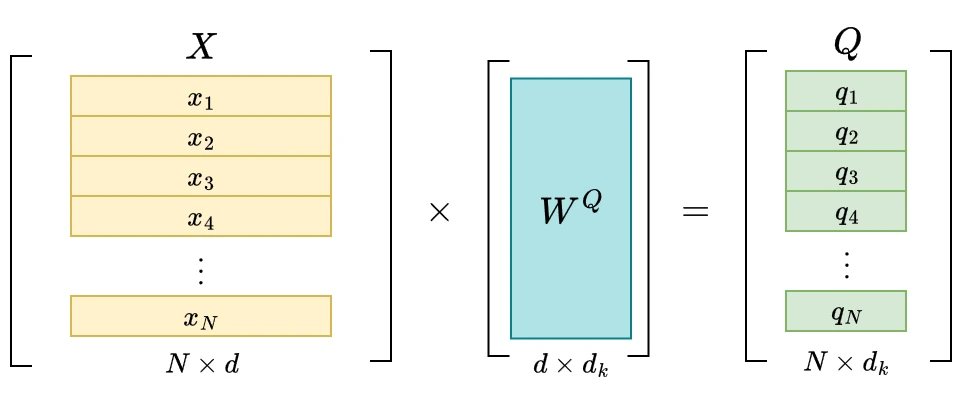

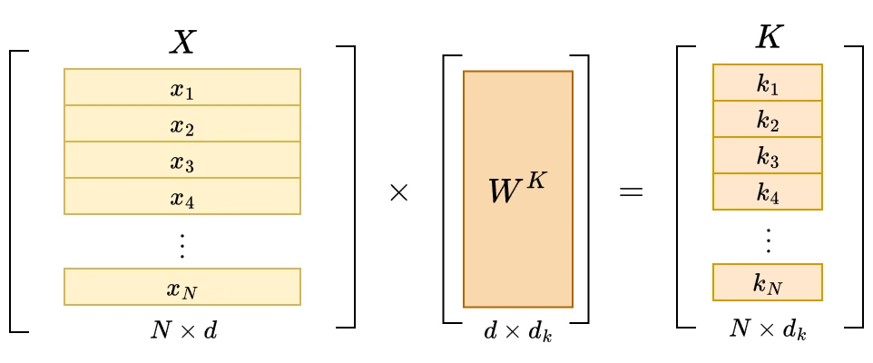

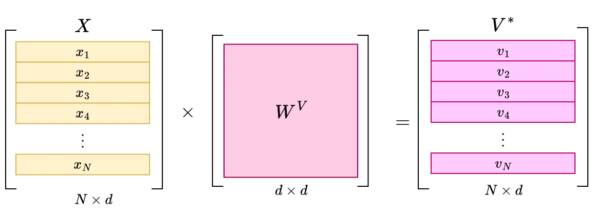

### QK Transpose (Dot-Product)

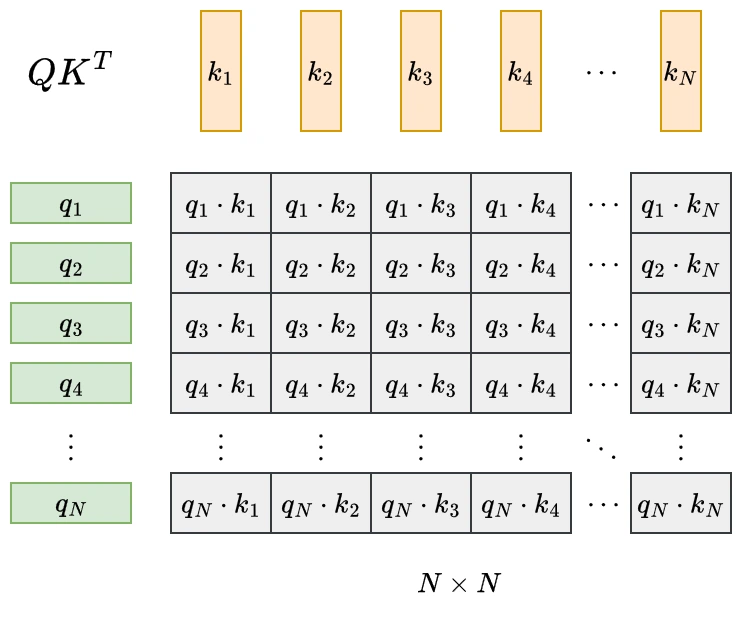

### Softmax

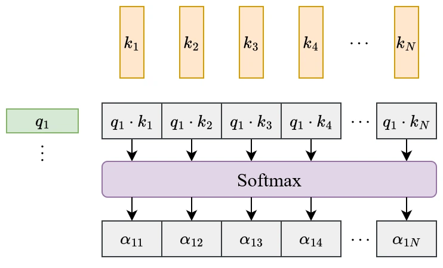

### Single-Head Attention

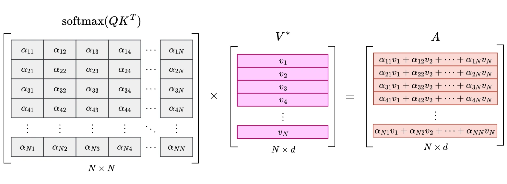

### Multi-Head Attention

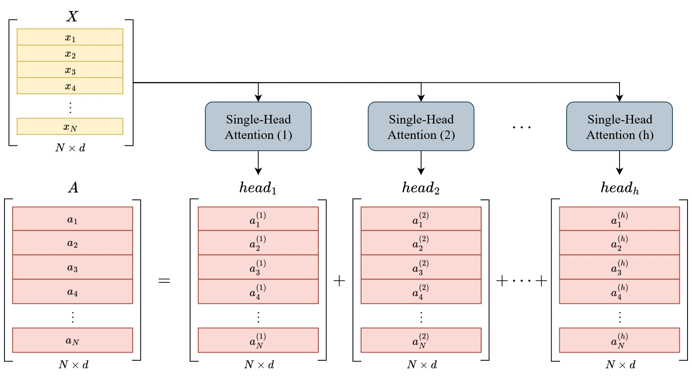

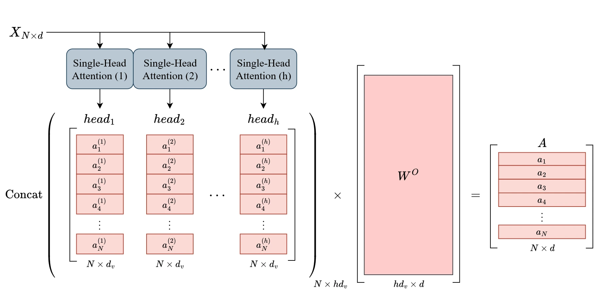

### Masked Attention

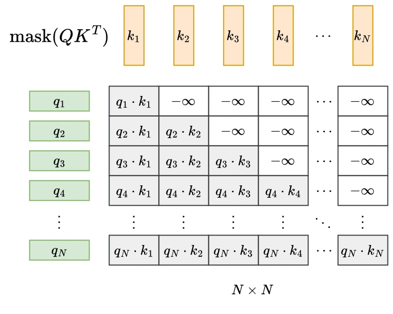

### Cross Attention

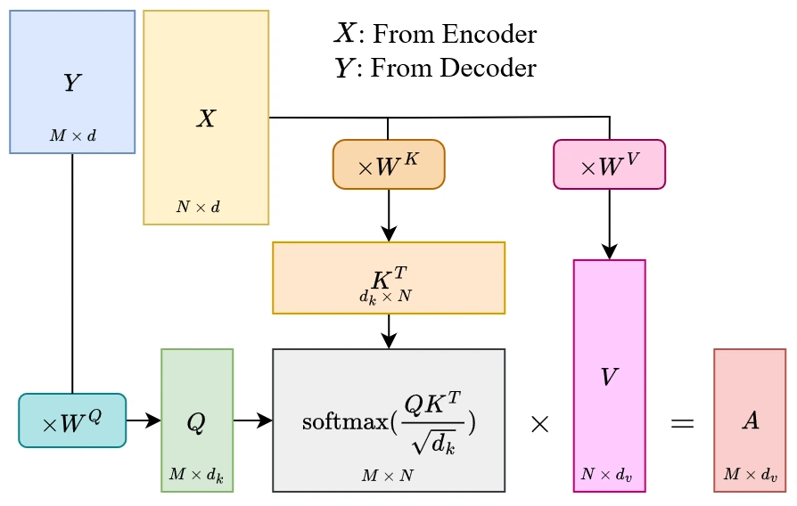

## Transformer

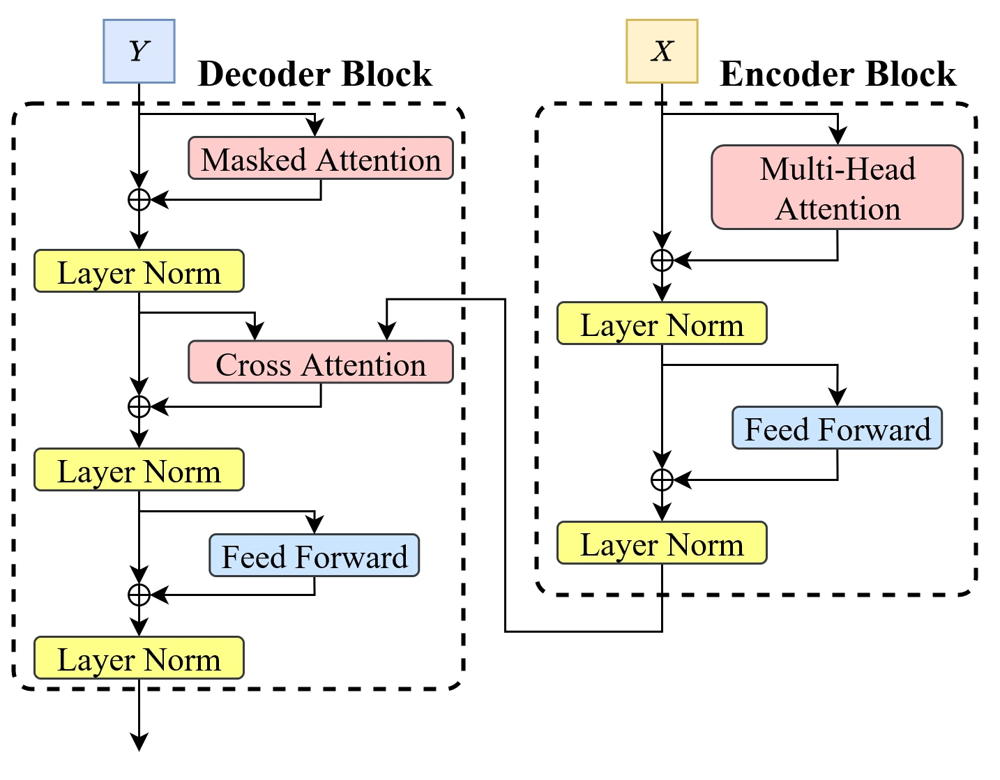

## License

The code for the slide and the report is licensed under the [MIT](https://opensource.org/license/mit) license. The figures are licensed under [CC-BY 4.0](https://creativecommons.org/licenses/by/4.0/) license.
